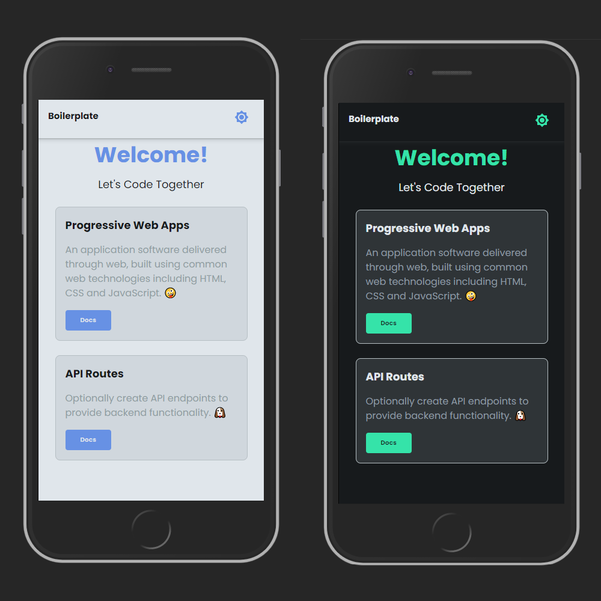

<p align="center">
  <a href="https://www.adazolhub.online">
    
    <h1 align="center">Adazolhub </h1>
  </a>
</p>
<p align="center">
    <h3 align="center"> Mobile React - Boilerplate </h3>
</p>



### Run Locally

Clone the project

```bash
 > git clone https://github.com/adazol123/mobile-first-react-boilerplate.git 'Your project name here'
```

Go to the project directory

```bash
 > cd 'Your project name here'
```

Install dependencies

```bash
 > npm install
 # or
 > yarn install
```

Start the server

```bash
 > npm run start
 # or
 > yarn start
```

Run the sass watcher

```bash

> sass --watch src/style/scss:src/style/css

```

#### Features

- Light/Dark mode toggle
- Live previews
- Progressive Web Apps
- SEO friendly
- Sass preprocessor scripting language

### Tech Stack

**Client:** React, Next, Sass with TailwindCSS inspired

**Server:** Node, MongoDB, Firebase

**Deployment:** Vercel, Firebase, Hostinger, Cloudflare

----

### Contributors

[Daniel Lozada](https://github.com/adazol123)

### License

[MIT](./license)
